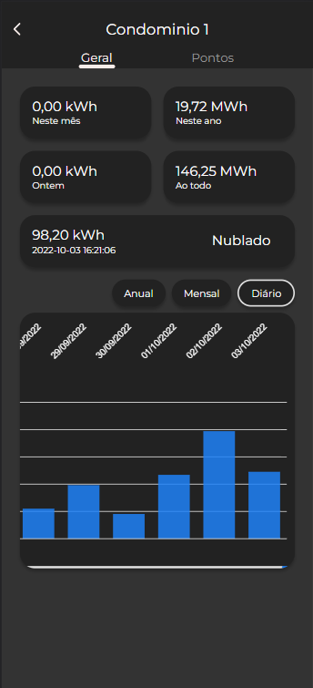
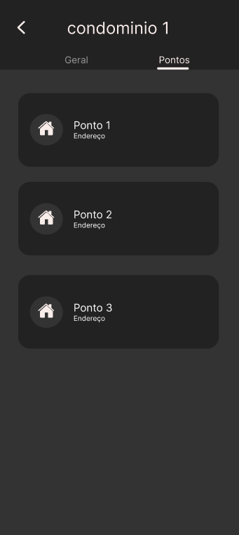

# Sunlight - Construtora planeta

## Técnologias

## Grupo

200411 - Alexander Victor Rodrigues Poliser (UP033LPIN1  / UP033TIN1  / CP600TIN2)

200089 - Deevis Billi Poul Rabelo de Araujo (UP033LPIN1  / UP033TIN1  / CP600TIN2)

200394 - Enzo Caíque Chanes Cassemiro (UP033LPIN1  / UP033TIN1  / CP600TIN2)

200109 - Leonardo Dimarchi Souza da Cruz (UP033LPIN1  / UP033TIN1  / CP600TIN2)

200359 - Luiz Fernando Toquetto (UP033LPIN1  / UP033TIN1  / CP600TIN2)

## Funcionalidades

- Login
- Visualização dos dados dos condominios (Geral)
- Visualização dos dados de um inversor (Ponto)

    
    
    

## Rodar o projeto

Necessário: 
- NodeJS v16.x.x

Comandos:
- npm i (para instalar as dependências)
- npm run start (para rodar o projeto na porta 4200)

## Script Python (Conversão Excel -> Json)
- [Repositório](https://github.com/enzocassemiro/sunlight-scrapper)
